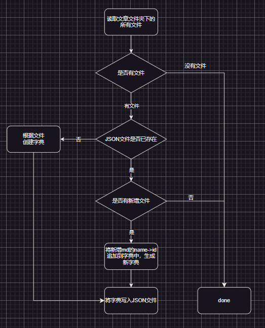

# 个人博客后端

基于 `Nodejs`，`Express`，`Nodemon`和 `MongoDB`开发提供给前端用于文章展示的 Sdk

## 安装

`npm i`

## 启动

`npm run server`

## 替换文章

文章路径：data

1. 删除 data 文件夹下所有内容
2. 添加文章（目前仅支持 markdown）
3. 重启服务

## 生成文章 id 字典



```
yarn build:id
```
